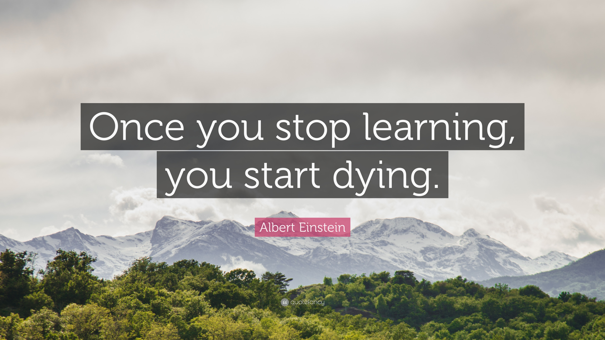

# Data Tutorials

**These tutorials are written purely out of two reasons: my own curiosity to learn unknown stuff, and my ambition to try teaching something I recently learned.**

**Let me know what you think - I am always happy to get critical and friendly feedback, or suggestions for improvement!**

